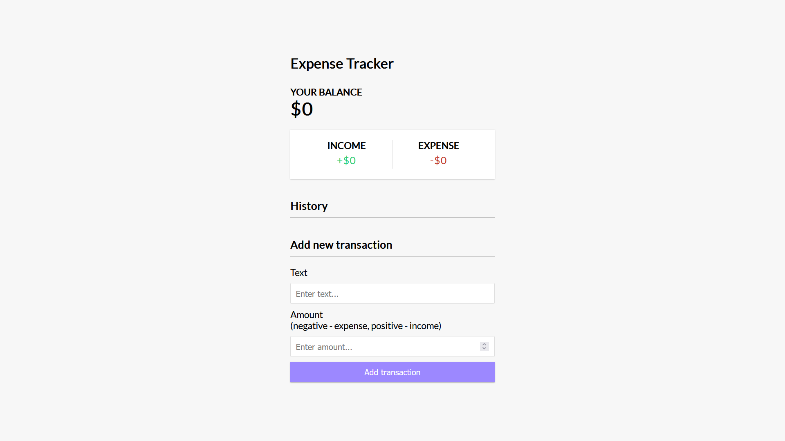
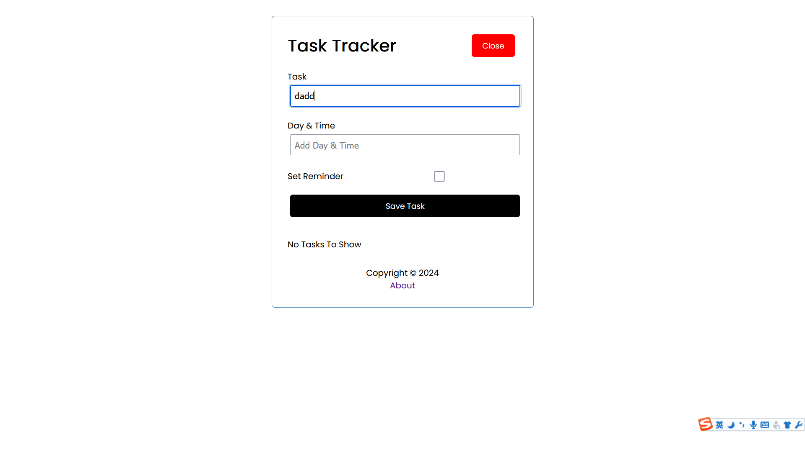
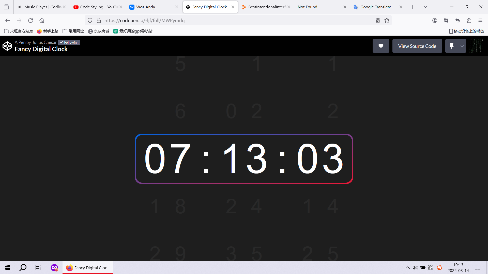
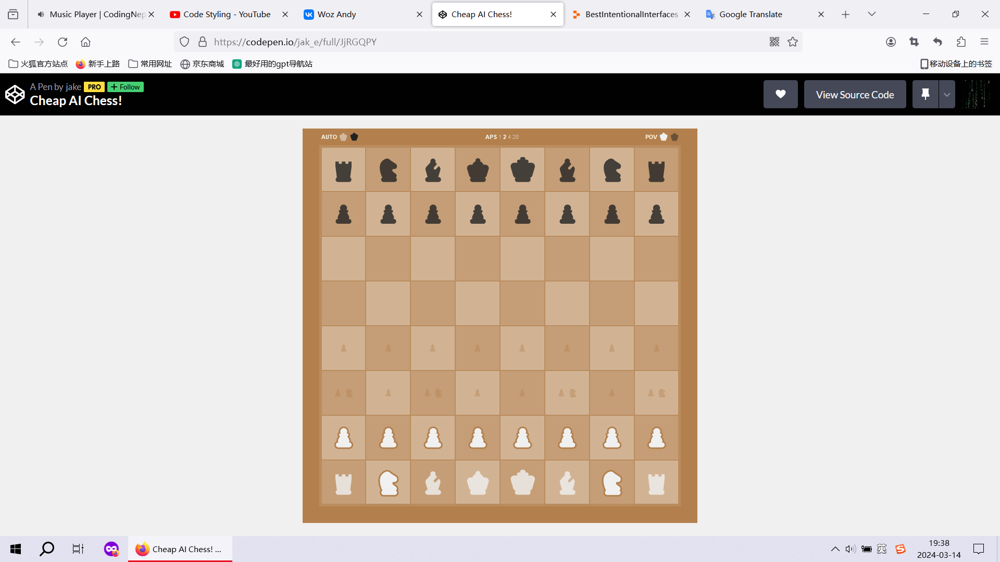
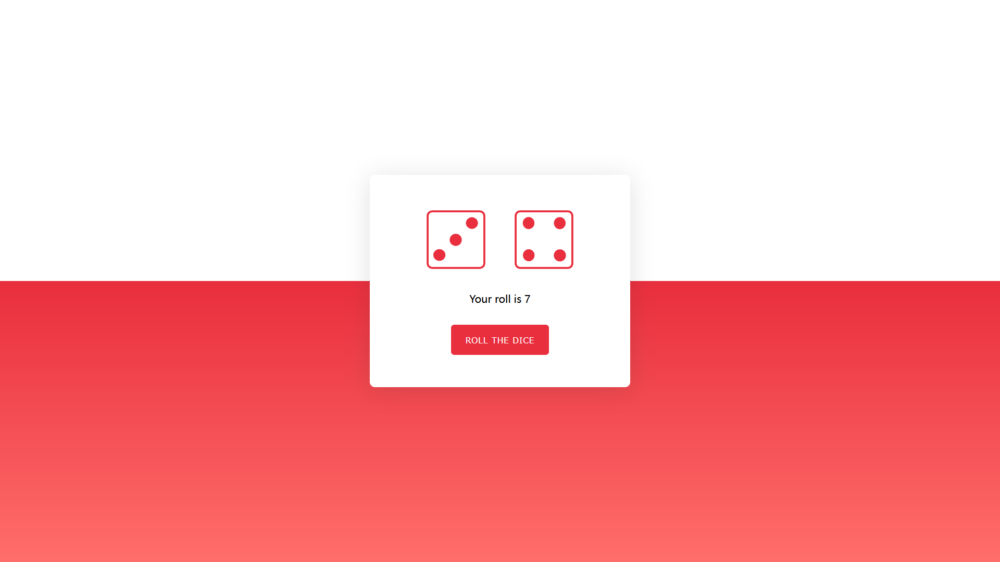
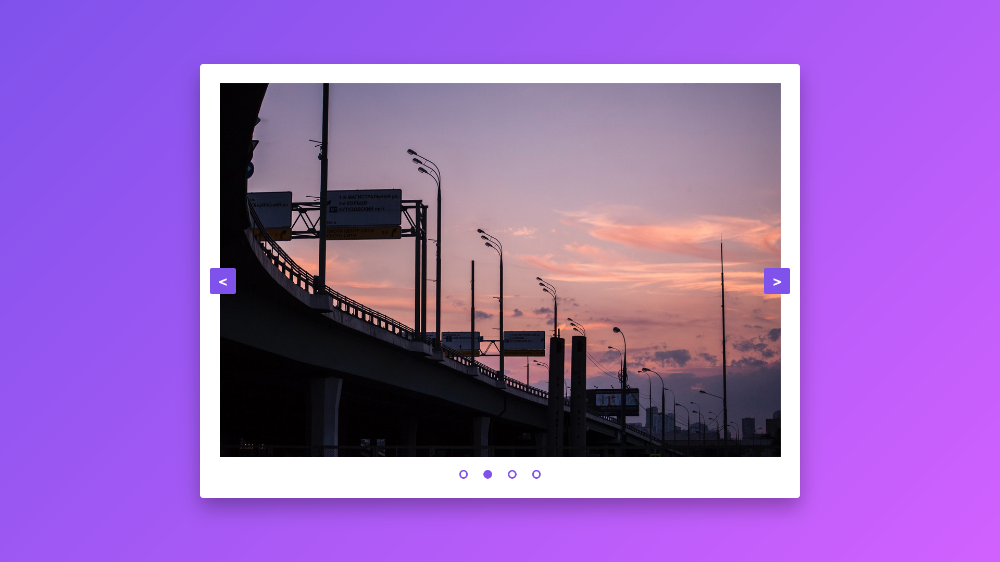
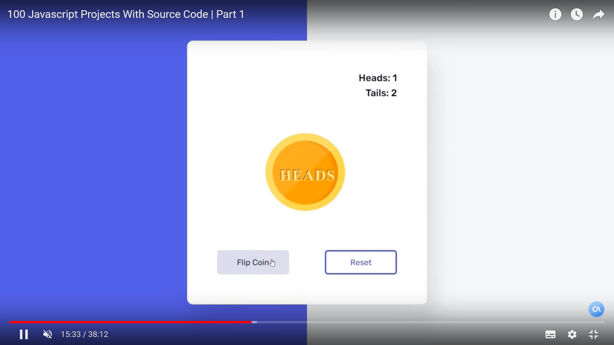
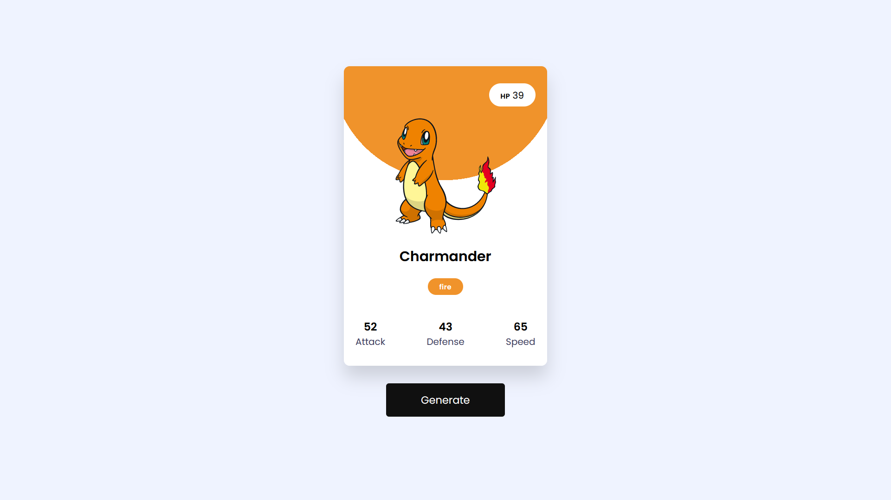
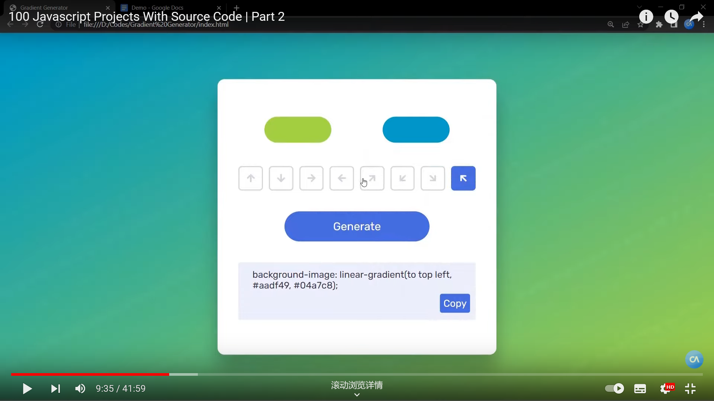
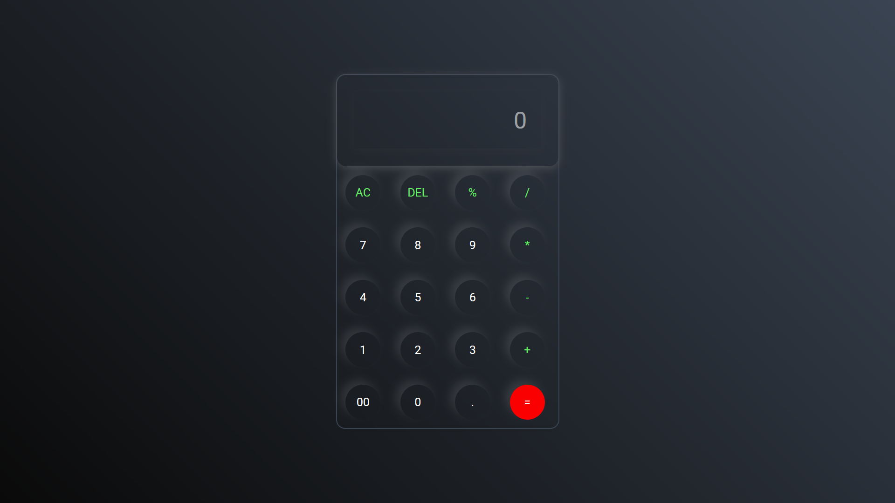

###  <link rel="icon" href="./calculator/favicon.ico" >

# Calculator
## Tutorial: [Calculator program ☀️](https://www.youtube.com/watch?v=lfmg-EJ8gm4)
## Live Demo: [Calculator](./calculator)

# Weather App
## Tutorial: [Weather App project ☀️](https://www.youtube.com/watch?v=lfmg-EJ8gm4)
## Credit:
### [Icon Image](https://emojipedia.org/)
## Live Demo: [Weather App](./weather-app)

# Color Picker
## Tutorial: [color picker app ☀️](https://www.youtube.com/watch?v=CgkZ7MvWUAA)
## Live Demo: [Color Picker](./color-picker)

# StopWatch
## Tutorial: [StopWatch App ☀️](https://www.youtube.com/watch?v=CgkZ7MvWUAA)
## Live Demo: [StopWatch](./stopWatch)

# To Do List
## Tutorial: [to-do-list App ☀️](https://www.youtube.com/watch?v=CgkZ7MvWUAA)
## Live Demo: [To Do List](./to-do-list)

# Digital Clock
## Tutorial: [Digital Clock App ☀️](https://www.youtube.com/watch?v=CgkZ7MvWUAA)
## Live Demo: [Digital Clock](./digitalClock)

# Expense Tracker
## Tutorial: [Expense Tracker App ☀️](https://www.youtube.com/watch?v=hNPwdOZ3qFU)
## Live Demo: [Expense Tracker](./expense-tracker)

# Task Tracker
## Tutorial: [Expense Tracker App ☀️](https://www.youtube.com/watch?v=w7ejDZ8SWv8)
## Live Demo: [Task Tracker](./task-tracker)

# Fancy Digital Clock
## Credit: [Fancy Digital Clock App ☀️](https://codepen.io/Hyperplexed/pen/XWeaWGL)
## Live Demo: [Fancy Digital Clock](./fancy-digital-clock)

# Cheap AI Chess
## Credit: [Cheap AI Chess ☀️](https://codepen.io/jak_e/pen/JjRGQPY)
## Live Demo: [Cheap AI Chess](./cheap-ai-chess)

# Roll The Dice
## Tutorial: [Roll The Dice ☀️](https://www.youtube.com/watch?v=6CMfZkLntX8)
## Live Demo: [Roll The Dice](./roll-the-dice)

# Image Slider
## Tutorial: [Image Slider ☀️](https://www.youtube.com/watch?v=-ba_hZxgNhU)
## Live Demo: [Image Slider](./image-slider)

# Flip A Coin
## Tutorial: [Flip A Coin ☀️](https://www.youtube.com/watch?v=yXEcd0eGrpw)
## Live Demo: [Flip A Coin](./flip-a-coin)

# Pokemon Card Generator
## Tutorial: [Pokemon Card Generator ☀️](https://www.youtube.com/watch?v=_JUSpgchD1I)
## Live Demo: [Pokemon Card Generator](./pokemon-card-generator)

# Gradient Generator
## Tutorial: [Gradient Generator ☀️](https://www.youtube.com/watch?v=Uf3-ef7HP3Y)
### Live Demo: [Gradient Generator](./gradient-generator)

# Calculator App
## Tutorial: [Calculator App ☀️](https://www.youtube.com/watch?v=I0lBiOtA6hc)
### Live Demo: [Calculator App](./bad-calculator)

