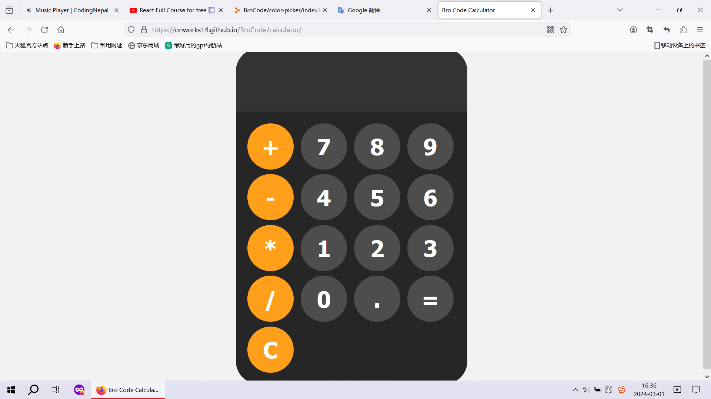
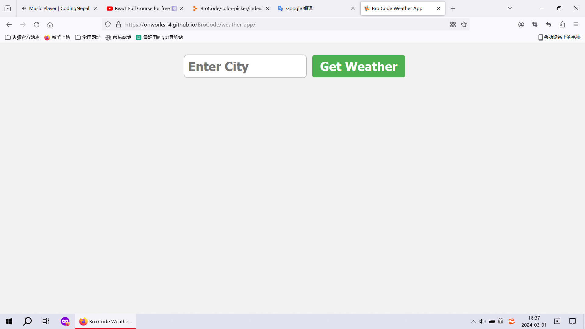
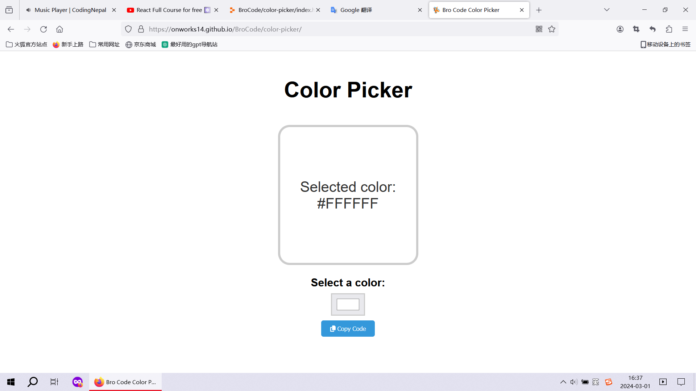
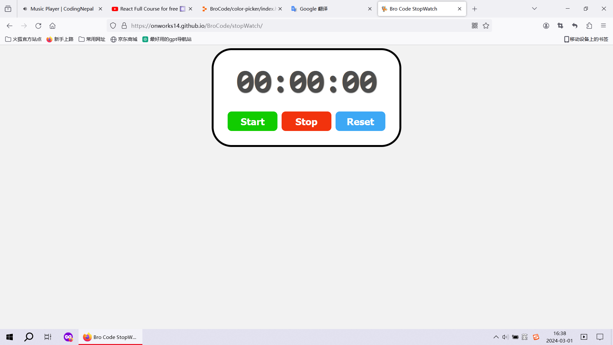
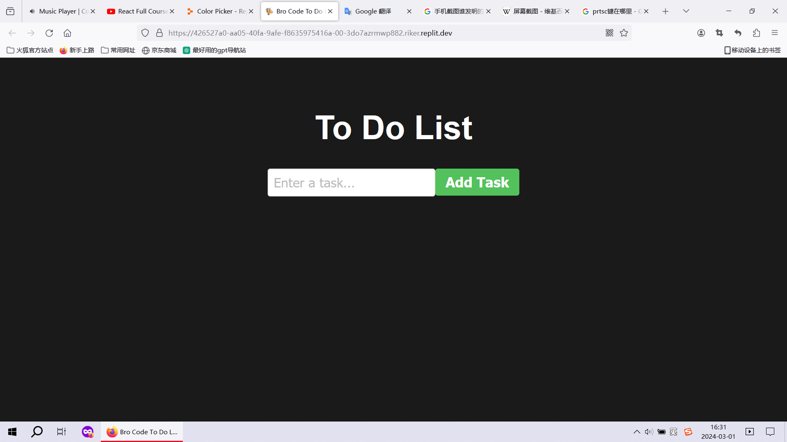
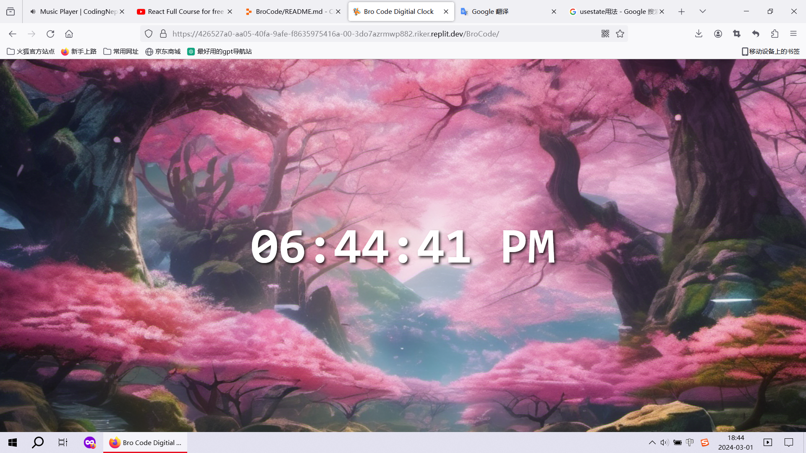

###  <link rel="icon" href="./calculator/favicon.ico" >

# Calculator
## Tutorial: [Calculator program ☀️](https://www.youtube.com/watch?v=lfmg-EJ8gm4)
## Live Demo: [Calculator](./calculator)

# Weather App
## Tutorial: [Weather App project ☀️](https://www.youtube.com/watch?v=lfmg-EJ8gm4)
## Credit:
### [Icon Image](https://emojipedia.org/)
## Live Demo: [Weather App](./weather-app)

# Color Picker
## Tutorial: [color picker app ☀️](https://www.youtube.com/watch?v=CgkZ7MvWUAA)
## Live Demo: [Color Picker](./color-picker)

# StopWatch
## Tutorial: [StopWatch App ☀️](https://www.youtube.com/watch?v=CgkZ7MvWUAA)
## Live Demo: [StopWatch](./stopWatch)

# To Do List
## Tutorial: [to-do-list App ☀️](https://www.youtube.com/watch?v=CgkZ7MvWUAA)
## Live Demo: [To Do List](./to-do-list)

# Digital Clock
## Tutorial: [Digital Clock App ☀️](https://www.youtube.com/watch?v=CgkZ7MvWUAA)
## Live Demo: [Digital Clock](./digitalClock)

